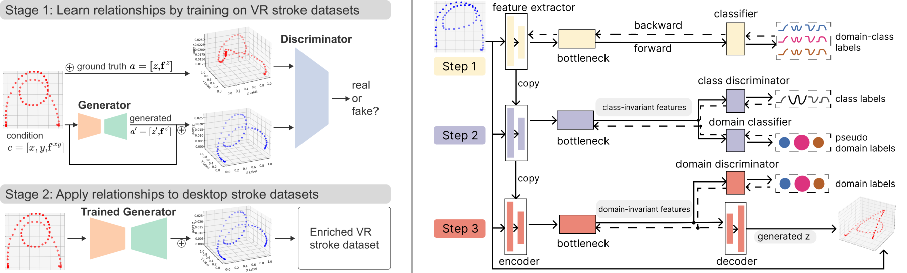

# Generating Virtual Reality Stroke Gesture Data from Out-of-Distribution Desktop Stroke Gesture Data

* * *



This repository contains code and datasets for the paper:
> Lin-Ping Yuan, Boyu Li, Jindong Wang, Huamin Qu, Wei Zeng. Generating Virtual Reality Stroke Gesture Data from Out-of-Distribution Desktop Stroke Gesture Data. In IEEE Conference on Virtual Reality and 3D User Interfaces (IEEE VR 2024)

This paper explores generating VR stroke gesture data from desktop stroke gesture data as an alternative input source that is out-of-distribution. We propose a time series generative network with novel designs of output space discretization and conditional domain-invariant representation learning.

### Table of Contents


- [I. Train](#i-train)
  - [Set Up the Environment](#set-up-the-environment)
  - [Data Preparation](#data-preparation)
  - [Run the Training Script](#run-the-training-script)
- [II. Inference](#ii-inference)
  - [Generate Inference Results](#generate-inference-results)
- [III. Evaluation](#iii-evaluation)
  - [Stroke Visualization](#stroke-visualization)
  - [Evaluation with Metrics](#evaluation-with-metrics)

## I. Train

### Set Up the Environment

We recommend using Conda to set up the project environment and manage dependencies:

```bash
conda create -n your_env_name python=3.8
conda activate your_env_name
pip install -r requirements.txt
```

This project has been tested on both Linux and Windows.

### Data Preparation

To train the time series generative model, we need a real VR stroke dataset. You can download the processed VR dataset from the following link: [VR_3DMadLab_processed.csv](https://drive.google.com/file/d/1BubXSAimb7ISnRtmBcZ347N_zkApDsHS/view?usp=sharing).
1. Create folder `./data/stroke/`
2. Place the downloaded `3DMadLab_processed.csv` file into the `./data/stroke/` folder.
3. Use the following command to convert the data to `.npy` format:

```bash
cd ./data
python read_data.py
```

After executing this script, you will find the `.npy` files in the `./data/stroke/` directory.

### Run the Training Script

To train the model, simply run the training script:

```bash
python main.py 
```
You can also train the model with different parameters.
```bash
python main.py --output_dir ./ --data_dir ./data/ --task stroke_data --test_envs 0 --dataset stroke --algorithm TDBself --latent_domain_num 5 --alpha1 0.1 --alpha 0.1 --lam 0 --local_epoch 3 --max_epoch 500 --lr 0.001 --eval_mode shape_domain --shapeclass_random --onlyxyz
```

This command will train the model and save the model weights in a `.pt` file. 

For better training, we added TensorBoard to view the changes in different losses during training. The program will automatically create a TensorBoard file saved in `log`, which you can view using the following command:

```bash
tensorboard --logdir=./log --port 8123
```
## II. Inference
### Generate Inference Results

With the model trained with real VR strokes, we can generate inference results by reloading the `.pt` file and executing the prediction function:

```bash
python main.py --weights weight_epoch15.pt --strokes_dir results --predict
```


The output results will be saved in separate CSV files, with each stroke corresponding to one file. The CSV files will contain 5 columns: x, y, z, pred_z, and t, representing the stroke's XYZ coordinates, predicted Z coordinate, and timestamp.

The trained model can also use a desktop stroke dataset as an alternative input source to generate VR strokes. Please download the processed desktop stroke dataset here: [Desktop_DigiLeTs_processed.csv](https://drive.google.com/file/d/1nieuPPr1n8PoAQ6bP7BguKWOPg-FrhUZ/view?usp=drive_link)

```bash

python main.py --data_dir ./data/ --task stroke_data --test_envs 0 --dataset stroke2d --algorithm TDBself --latent_domain_num 5 --alpha1 0.1 --alpha 0.1 --lam 0 --local_epoch 3 --max_epoch 500 --lr 0.001 --eval_mode infer2d --shapeclass_random --predict

```


## III. Evaluation
### Stroke Visualization

Let's visualize the stroke images by using the `output_img.py` script. Before running the script, configure the result data path in `output_img.py`. For example:

```python
data_path='./evaluation/shape/shape3/results' 
```

Now, execute the following command:

```bash
python output_img.py
```

The script will create a folder named `img` and save all result images in it.

### Evaluation with Metrics

To evaluate the results, we have included some metrics such as FD, Hausdorff, and MMD:

```bash
cd metrics
python get_fea.py  # output the metric results
```

## Questions
If you have any questions, feel free to email Linping Yuan via lyuanaa@connect.ust.hk
* * *